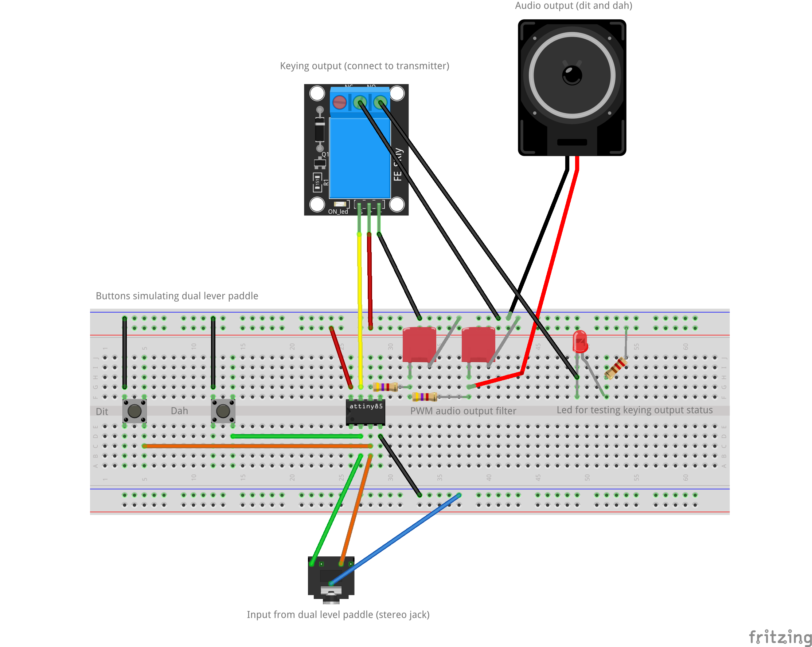

# tiny_iambic_decoder implemented on ATTiny85

Allows to use iambic (dual lever) morse paddle with inputs that expect normal paddle.

## Background story

Some morse code enthusiast gave me a [pocket morse code reader device](https://www.hamradiostore.co.uk/product/mfj-461/) that can listen to morse code sound and then decode it and display as text on LCD screen. The problem is that he wants to use it with [dual lever paddle](https://www.onallbands.com/215/) also known as iambic keyer. The keyer won't generate a sound needed by morse reader and the extra difficulty is that dual lever paddle has two outputs - one for "dit" symbol and another one for "dah". The signals from the outputs have to be interpreted and then the relevant sound generated basing on that information (short duration sine wave for "dit" and the long sine for "dah"). 

## I/O

Input:
- Two LOW/HIGH signals (pin 3 and pin 4) from dual lever paddle connected through stereo mini jack 3.5mm socket. The paddle will short the either connection representing dit or dah to ground so the MCU can interpret the lever being pushed as LOW value on input pin.

Outputs:
- LOW/HIGH Signal on pin 2 to drive the relay. The purpose of the relay is to simulate what normal paddle does when it is connected to the transmitter - that is, to ground single signal line when morse operator pushes the lever and to open it when he/she lets the lever go.
- Audio signal generated with pulse width modulation so that you can just connect it to audio amplifier and listen to dits and dahs sounds without the transmitter.

## Connections

<figure>

<figcaption>ATTiny85 pinout</figcaption>
</figure>

<figure>

<figcaption>Tiny iambic decoder breadboard</figcaption>
</figure>
